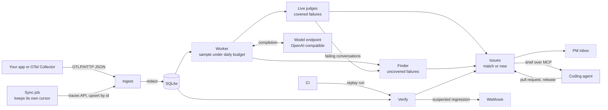

# System overview

Conversations flow in, the worker detects failures, issues collect them, and the fix-and-verify loop closes them. Dashed boxes are planned.

```mermaid
flowchart LR
  app["Your app or OTel Collector"] -->|"OTLP/HTTP JSON"| ingest["Ingest"]
  sync["Sync job<br/>keeps its own cursor"] -->|"traces API, upsert by id"| ingest
  ingest -->|"redact"| db[("SQLite")]
  db --> worker["Worker<br/>sample under daily budget"]
  worker --> judges["Live judges<br/>covered failures"]
  worker --> finder["Finder<br/>uncovered failures"]
  judges -->|"failing conversations"| finder
  worker <-->|"completion"| model["Model endpoint<br/>OpenAI-compatible"]
  judges --> issues["Issues<br/>match or new"]
  finder --> issues
  issues --> inbox["PM inbox"]
  issues -->|"brief over MCP"| agent["Coding agent"]
  agent -->|"pull request, release"| issues
  ci["CI"] -->|"replay run"| verify["Verify"]
  db --> verify
  verify --> issues
  verify -->|"suspected regression"| hook["Webhook"]
  classDef planned stroke-dasharray: 5 5
  class worker,finder,verify,hook,inbox planned
```
