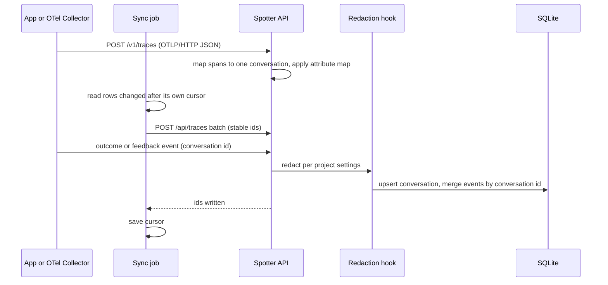

# Ingest

Two front doors write through one upsert keyed by conversation id, so a retry changes nothing. Outcome and feedback events attach to the same conversation.

```mermaid
sequenceDiagram
  participant App as App or OTel Collector
  participant Job as Sync job
  participant API as Spotter API
  participant R as Redaction hook
  participant DB as SQLite
  App->>API: POST /v1/traces (OTLP/HTTP JSON)
  API->>API: map spans to one conversation, apply attribute map
  Job->>Job: read rows changed after its own cursor
  Job->>API: POST /api/traces batch (stable ids)
  App->>API: outcome or feedback event (conversation id)
  API->>R: redact per project settings
  R->>DB: upsert conversation, merge events by conversation id
  API-->>Job: ids written
  Job->>Job: save cursor
```
