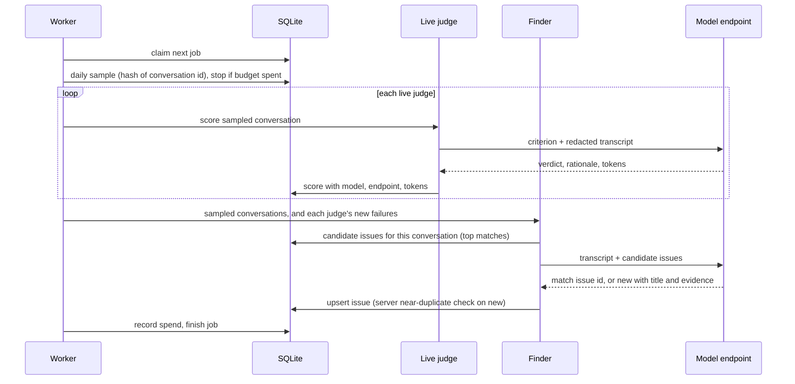

# Detect

One worker runs both detectors. Live judges cover known failures. The finder looks for uncovered failures, and it also splits one judge's failures into distinct problems.

```mermaid
sequenceDiagram
  participant W as Worker
  participant DB as SQLite
  participant J as Live judge
  participant F as Finder
  participant M as Model endpoint
  W->>DB: claim next job
  W->>DB: daily sample (hash of conversation id), stop if budget spent
  loop each live judge
    W->>J: score sampled conversation
    J->>M: criterion + redacted transcript
    M-->>J: verdict, rationale, tokens
    J->>DB: score with model, endpoint, tokens
  end
  W->>F: sampled conversations, and each judge's new failures
  F->>DB: candidate issues for this conversation (top matches)
  F->>M: transcript + candidate issues
  M-->>F: match issue id, or new with title and evidence
  F->>DB: upsert issue (server near-duplicate check on new)
  W->>DB: record spend, finish job
```
