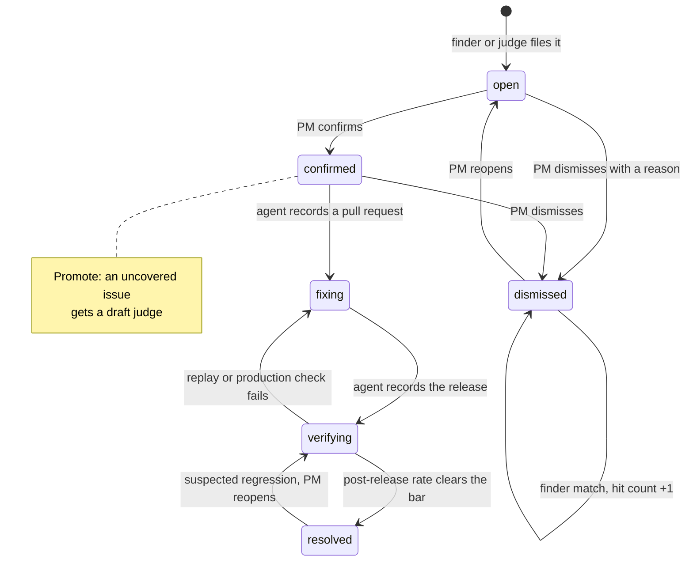

# Issue lifecycle

Agents file and attach. Humans confirm, dismiss, reopen, and resolve. A dismissed issue never returns to the inbox. A match increments its hit count instead.

Today the code has `open`, `confirmed`, and `dismissed`. The other states are planned.
