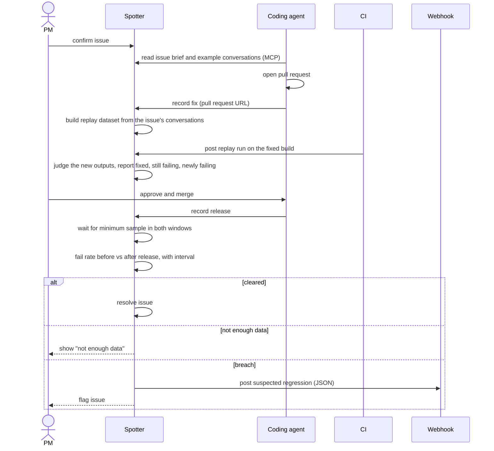

# Fix and verify

The agent proposes and the PM approves. Verify runs twice: a replay before release, and a before-and-after comparison in production.

```mermaid
sequenceDiagram
  actor PM
  participant S as Spotter
  participant A as Coding agent
  participant CI
  participant Hook as Webhook
  PM->>S: confirm issue
  A->>S: read issue brief and example conversations (MCP)
  A->>A: open pull request
  A->>S: record fix (pull request URL)
  S->>S: build replay dataset from the issue's conversations
  CI->>S: post replay run on the fixed build
  S->>S: judge the new outputs, report fixed, still failing, newly failing
  PM->>A: approve and merge
  A->>S: record release
  S->>S: wait for minimum sample in both windows
  S->>S: fail rate before vs after release, with interval
  alt cleared
    S->>S: resolve issue
  else not enough data
    S-->>PM: show "not enough data"
  else breach
    S->>Hook: post suspected regression (JSON)
    S-->>PM: flag issue
  end
```
