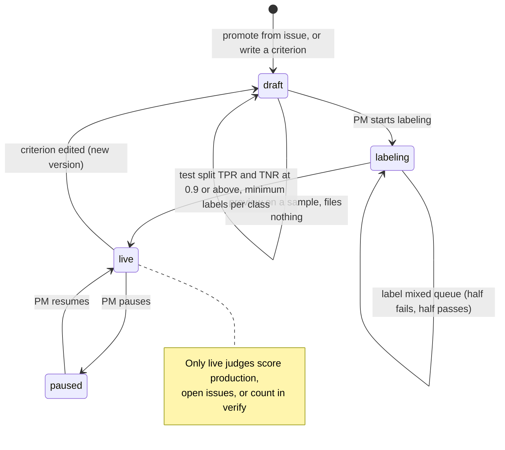

# Judge calibration

A judge acts only after human labels show it agrees with people. The label queue mixes the judge's passes and fails, so the true-negative rate is measured on real negatives.

Today the code has judge versions, human labels, and calibration rates (`judge_calibration`). The `draft` and `live` gate is planned.
