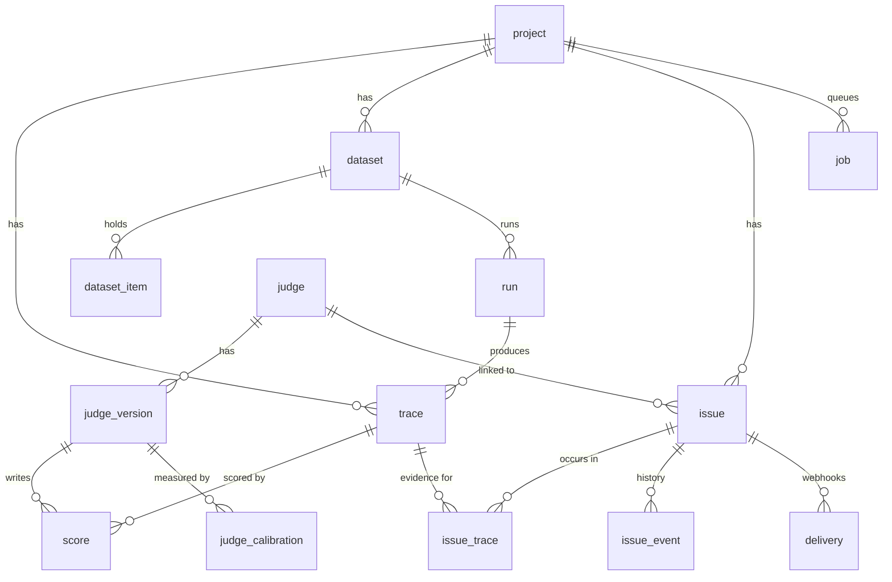

# Data model

Tables that exist today, plus the planned additions. Planned columns appear in the relationship labels and in the table below.

| Table | Status | Planned changes |
|---|---|---|
| `trace` | Today | Add `release`, promoted from `service.version`. |
| `score` | Today | Add `model`, `endpoint`, and token counts. |
| `judge_version` | Today | Add `state`: `draft`, `live`, or `paused`. |
| `issue` | Today | Add `source` (`judge` or `finder`), `hits`, `last_seen_at`, `fix_release`, `pr_url`. Add the `fixing`, `verifying`, and `resolved` statuses. |
| `issue_event` | Planned | Append-only history: actor, from, to, reason, run, or pull request. |
| `job` | Planned | One row per unit of worker work. The worker claims it with `UPDATE ... RETURNING`. |
| `delivery` | Planned | Webhook outbox with retries. Replaces `alert_rule` and `alert_delivery`. |
