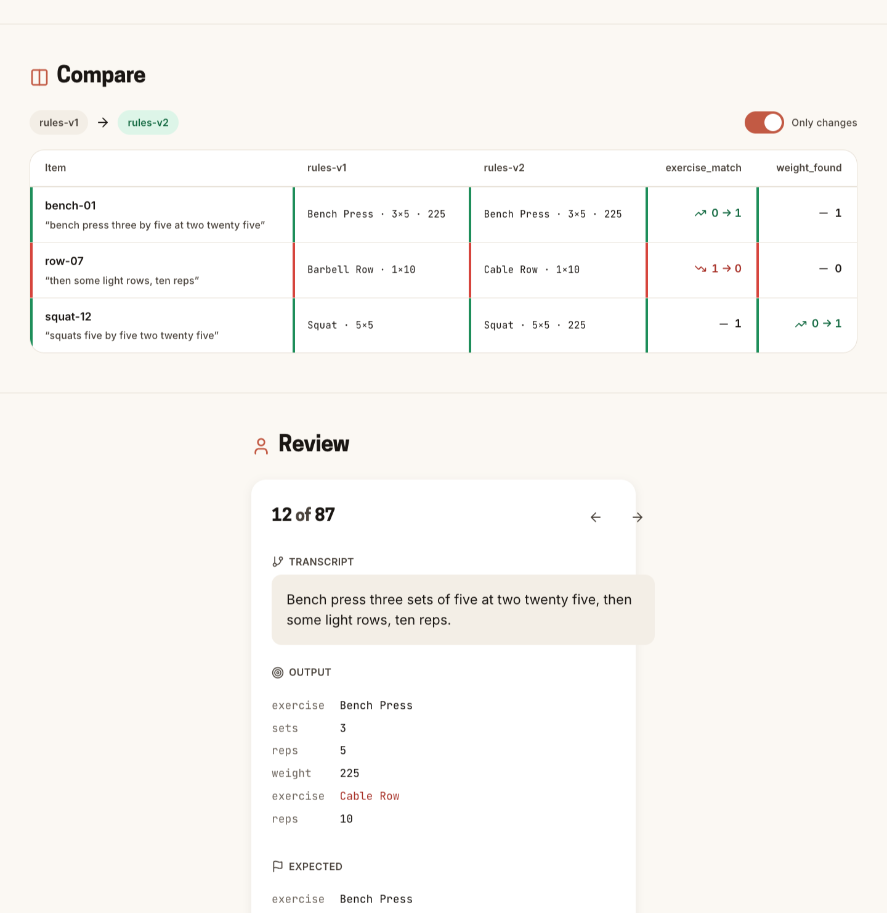

# Font pairs

Five candidates. Toggle between them in `design-system/preview/index.html`. Screenshots are 1440px wide, light theme; one dark capture for the brand pair.

| Id | Heading | Body | Character |
|---|---|---|---|
| `brand` | Cooper Hewitt | Inter | Matches the Copper iOS app. Geometric, slightly narrow. |
| `jakarta` | Plus Jakarta Sans | Inter | Rounded, friendly, closest to a consumer product. |
| `grotesk` | Space Grotesk | IBM Plex Sans | Quirky terminals on the headings, sober body. |
| `fraunces` | Fraunces | Work Sans | Serif display. The only pair that does not look like software. |
| `dm` | DM Sans | DM Sans | One family. Calm, low contrast between roles. |

## Type specimen

## Full page

| Pair | Light | |
|---|---|---|
| brand | [light](../../design-system/preview/screenshots/font-brand-light.png) | [dark](../../design-system/preview/screenshots/font-brand-dark.png) |
| jakarta | [light](../../design-system/preview/screenshots/font-jakarta-light.png) | |
| grotesk | [light](../../design-system/preview/screenshots/font-grotesk-light.png) | |
| fraunces | [light](../../design-system/preview/screenshots/font-fraunces-light.png) | |
| dm | [light](../../design-system/preview/screenshots/font-dm-light.png) | |

## Recommendation

`brand` for continuity with the app, `fraunces` if the eval tool should feel like a different product. Change `defaultFontPairId` in `design-system/src/tokens/typography.ts` to lock the choice.
