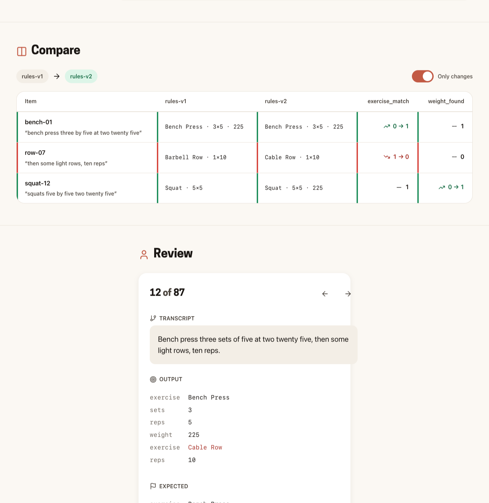
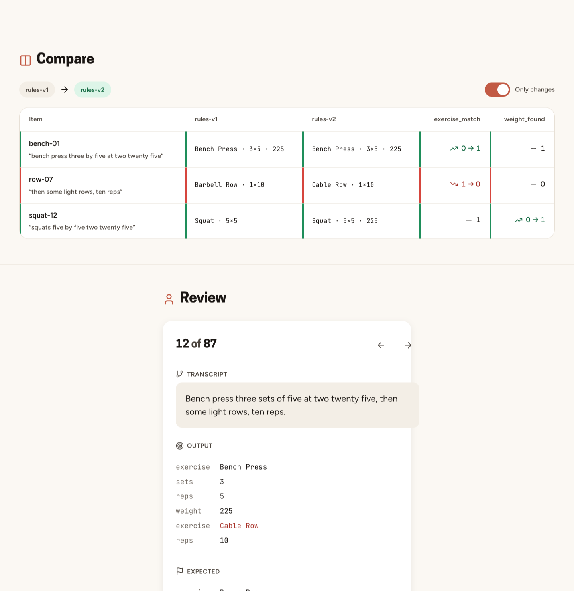
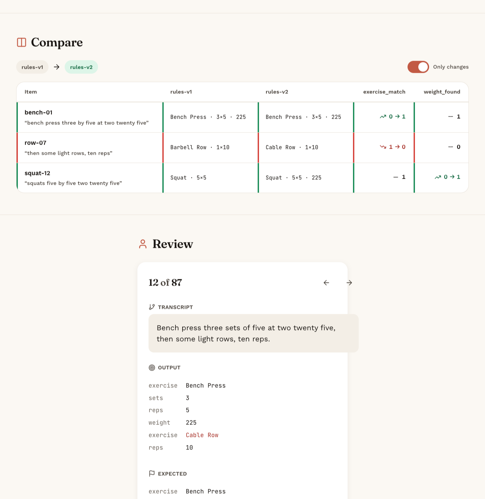

# Font pairs

Eight candidates. Toggle between them in `design-system/preview/index.html`. Screenshots are 1440px wide, light theme, captured on macOS so San Francisco renders as SF Pro. One dark capture for the default pair.

| Id | Heading | Body | Character |
|---|---|---|---|
| `brand-sf` | Cooper Hewitt | San Francisco | What the Copper iOS app uses. Default. |
| `sf` | San Francisco | San Francisco | Pure Apple. Segoe or Roboto on other platforms. |
| `cooper-figtree` | Cooper Hewitt | Figtree | Same look on every platform. |
| `jakarta` | Plus Jakarta Sans | Figtree | Rounded, consumer feel. |
| `outfit` | Outfit | Source Sans 3 | Geometric display, humanist body. |
| `grotesk` | Space Grotesk | IBM Plex Sans | Quirky terminals on the headings, sober body. |
| `fraunces` | Fraunces | Work Sans | Serif display. The only pair that does not look like software. |
| `dm` | DM Sans | DM Mono | One family. Calm, low contrast between roles. |

San Francisco has no web download. The stack is `-apple-system, "SF Pro Text", system-ui`, so it resolves to SF on Apple devices and to the platform sans elsewhere.

## Type specimen

## Full page

| Pair | Light | Dark |
|---|---|---|
| brand-sf | [light](../../design-system/preview/screenshots/font-brand-sf-light.png) | [dark](../../design-system/preview/screenshots/font-brand-sf-dark.png) |
| sf | [light](../../design-system/preview/screenshots/font-sf-light.png) | |
| cooper-figtree | [light](../../design-system/preview/screenshots/font-cooper-figtree-light.png) | |
| jakarta | [light](../../design-system/preview/screenshots/font-jakarta-light.png) | |
| outfit | [light](../../design-system/preview/screenshots/font-outfit-light.png) | |
| grotesk | [light](../../design-system/preview/screenshots/font-grotesk-light.png) | |
| fraunces | [light](../../design-system/preview/screenshots/font-fraunces-light.png) | |
| dm | [light](../../design-system/preview/screenshots/font-dm-light.png) | |

## Recommendation

`brand-sf` for continuity with the app, `fraunces` if the eval tool should feel like a different product. Change `defaultFontPairId` in `design-system/src/tokens/typography.ts` to lock the choice.
