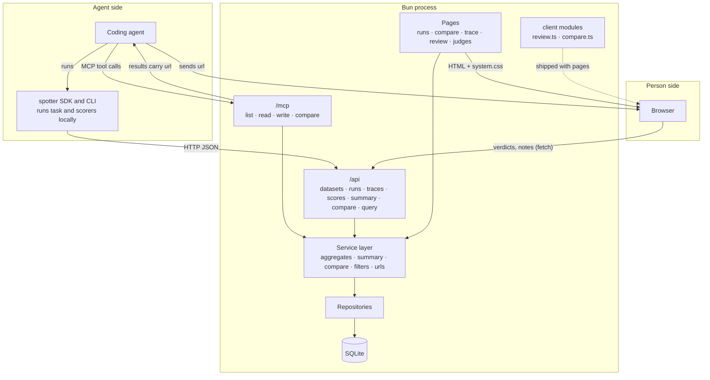
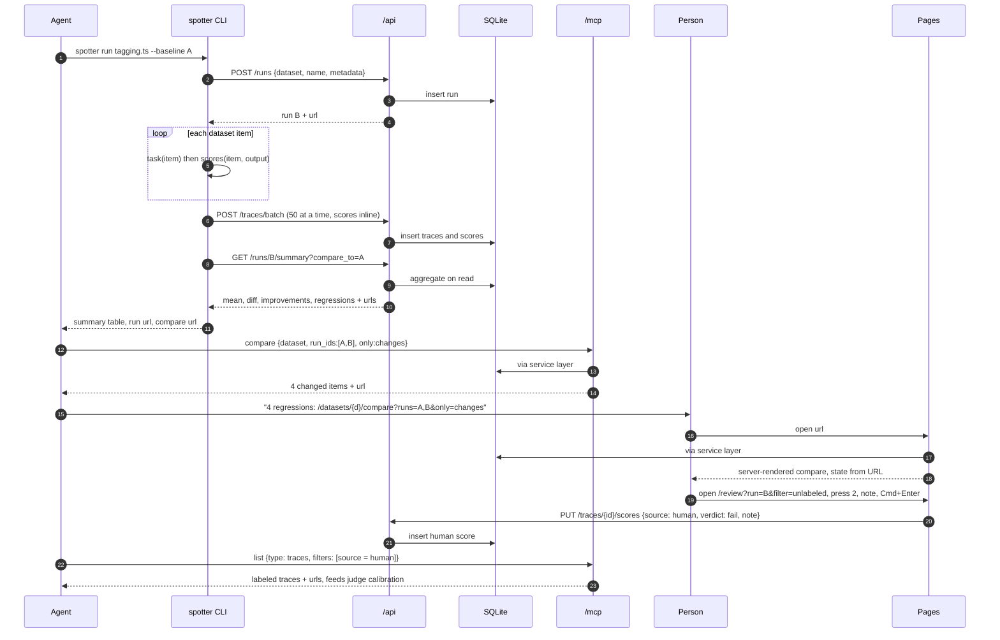

# Implementation plan: Spotter skeleton

**Date**: 2026-09-06
**Type**: feature
**Status**: Draft, awaiting review
**Depends on**: `docs/design/eval-tool-design.md`, `design-system/`
**Repo**: `github.com/itsmeterrylin/spotter`

## Summary

Build the first runnable version of Spotter, the human in the loop for agent-run evals: one Bun process that serves the REST API, the MCP endpoint, and server-rendered pages, backed by SQLite. Agents run evals through the SDK and MCP. A person opens deep links to verify results, label traces, and calibrate judges.

## Goals

1. An agent can create a dataset, run a task locally, write traces and scores, and compare two runs without touching the UI.
2. Every REST and MCP response carries a `url` that opens the exact state it describes.
3. A person can review traces with the keyboard and label them Pass, Fail, or Defer in under two seconds per trace.
4. A judge's scores count only after it is calibrated against human labels.

## Non-goals

Prompt management, playgrounds, dashboards, alerts, sessions or threads, multi-user auth, server-side task execution, OTLP ingestion, a Python SDK. Each can be added later; none blocks the loop above.

## Stack

Pinned to exact versions. A version is adopted only after it has been public for 60 days, which is the age gate for supply-chain worms that spread through fresh releases. Newer versions listed for reference are not used.

| Layer | Package | Pinned | Published | Newest, not adopted |
|---|---|---|---|---|
| Runtime | Bun | 1.3.9 | 2026-02-08 | 1.4.2 (2026-09-05) |
| HTTP, pages, routing | `hono` | 4.12.28 | 2026-07-06 | 4.13.7 (2026-09-04) |
| MCP transport | `@hono/mcp` | 0.3.0 | 2026-05-16 | 0.3.2 (2026-08-18) |
| MCP server | `@modelcontextprotocol/sdk` | 1.29.0 | 2026-03-30 | 1.30.0 (2026-07-27) |
| Validation | `zod` | 4.4.3 | 2026-05-04 | 4.5.4 (2026-08-29) |
| Types | `typescript` | 5.9.3 | see registry | 7.0.2 (2026-07-08, new compiler, not adopted yet) |
| Node types | `@types/node` | 25.9.5 | see registry | 26.4.1 (2026-09-01) |
| Database | `bun:sqlite` | built into Bun 1.3.9 | | |
| Client code | Vanilla TypeScript modules, no framework | | | |
| Styles | `design-system/dist/system.css` | built from tokens | | |

### Dependency policy

1. **Exact pins.** No `^` or `~` anywhere. `.npmrc` sets `save-exact=true`; `bunfig.toml` sets `exact = true`.
2. **60-day age gate.** `bunfig.toml` sets `[install] minimumReleaseAge = 5184000` (seconds), so `bun install` refuses versions younger than 60 days. `design-system/scripts/check-release-age.mjs` runs the same check against `package.json` for the npm-managed package and fails CI if any pin is too new or not exact.
3. **Lockfiles committed.** `bun.lock` for the app, `package-lock.json` for the design system. Install with `bun install --frozen-lockfile` and `npm ci`.
4. **No lifecycle scripts from dependencies.** `bunfig.toml` keeps the default `trustedDependencies` empty; `npm` runs with `ignore-scripts=true` in CI.
5. **Runtime pinned.** `.bun-version` holds `1.3.9`; `engines.bun` matches. Upgrades are a deliberate commit, never automatic.
6. **Review before bumping.** A bump PR lists the changelog and the publish date. Nothing is bumped inside 60 days of publish, even for a fix, unless the fix is a security advisory that affects this code.

## Architecture

One Bun process. Three entry points share one service layer and one SQLite file. The agent talks to MCP or REST. The person talks to the pages. Nothing talks to the database except the repositories.



Data flow for one eval loop:



Three rules keep this simple:

1. **One service layer.** MCP, REST, and pages call the same functions, so a run summary is identical no matter who asked.
2. **URLs are built in one place.** `src/urls.ts` is the only code that knows the route shapes. REST, MCP, CLI, and pages import it.
3. **The browser writes only human input.** Verdicts and notes go through the same REST endpoint the SDK uses. Everything else on a page is server-rendered from the URL.

## User stories

```gherkin
Scenario: Agent runs an eval and hands over links
  Given a dataset "tagging-golden" with 120 items exists
  When the agent runs `spotter run evals/tagging.ts --dataset tagging-golden`
  Then a run is created with one trace per item and scores per trace
  And the CLI prints a summary table with mean, diff, improvements, regressions per score
  And the CLI prints the run URL and the compare URL against the previous run

Scenario: Person verifies a regression from a deep link
  Given run B regressed on 4 items versus run A
  When the person opens /datasets/{id}/compare?runs=A,B&only=changes
  Then only the 4 changed items are shown, each with both outputs and per-score deltas

Scenario: Person labels traces with the keyboard
  Given the review queue /review?run=B&filter=unlabeled has 12 traces
  When the person presses 2, types a note, and presses Cmd+Enter
  Then the trace gets a human score {verdict: fail, note}, the page advances, and the counter reads "11 remaining"

Scenario: Judge scores are gated by calibration
  Given a judge "exercise_match" has TPR 0.94 and TNR 0.91 on the held-out set
  When a run's aggregates are computed
  Then judge scores are included
  And a judge with no calibration record shows "Needs labels" and its scores are excluded from aggregates

Scenario: Agent improves a judge without editing it in place
  Given judge "exercise_match" version 3 is active with TNR 0.72
  When the agent lists disagreements for version 3, proposes a prompt change, and runs version 4 on the labeled traces
  Then version 4 exists with its own TPR and TNR, version 3 is unchanged, and nothing is active until judge.activate is called

Scenario: Roll back a judge
  Given version 4 is active and its TNR on new labels drops below 0.9
  When the person or agent calls judge.activate with version 3
  Then version 3 is active again and its stored calibration applies

Scenario: MCP compare
  Given runs A and B share a dataset
  When an agent calls the MCP tool compare with run_ids [A, B]
  Then it receives per-item rows with outputs and scores per run, a per-score summary, and a url to the compare page
```

## Functional requirements

1. FR1 Datasets: create; upsert items by client id with `input`, `expected`, `metadata`.
2. FR2 Runs: create with `dataset_id`, `name`, `metadata`; aggregates computed on read.
3. FR3 Traces: batch insert with optional `run_id`, `dataset_item_id`, inline `scores[]`; ids are client-generated UUIDv7.
4. FR4 Scores: add or replace on a trace; `source` in `sdk`, `judge`, `human`; human scores carry `verdict` and `note`.
5. FR5 Summary: per score name, mean, diff versus a comparison run, counts of improvements and regressions.
6. FR6 Compare: items with nested per-run cells; filter `only=changes`.
7. FR7 Filters: `[{field, key, operator, value}]` with symbol operators on the trace list.
8. FR8 Query: read-only SQL over the tables, rejects anything that is not a single SELECT.
9. FR9 MCP: `list`, `read`, `write`, `compare`; every result includes `url`.
10. FR10 Pages: runs list, run detail, compare, trace detail, review, judges; every filter and selection lives in the URL.
11. FR11 SDK and CLI: `defineEval({ dataset, task, scores, metadata })`; `spotter run`, `spotter compare`; `--no-send` prints only.
12. FR12 Judge calibration: store human-vs-judge agreement per judge version; compute TPR, TNR, and a bias-corrected pass rate with a bootstrap interval.
13. FR13 Judge versioning: judges are immutable versions with one active pointer; any definition change creates a version (hash-deduplicated); `judge.propose` and `judge.activate` through REST and MCP; rollback is activation of an older version; disagreements listable per version.

## Deep link contract

| Object | URL | State in query |
|---|---|---|
| Runs list | `/runs?dataset={id}` | dataset |
| Run | `/runs/{run_id}?score={name}` | selected score column |
| Compare | `/datasets/{dataset_id}/compare?runs={a},{b}&only=changes&score={name}` | runs, filter, score |
| Trace | `/traces/{trace_id}` | |
| Dataset item across runs | `/datasets/{dataset_id}/items/{item_id}` | |
| Review queue | `/review?run={run_id}&filter=unlabeled` | run, filter |
| Review one trace | `/review/{trace_id}?run={run_id}` | queue context |
| Judge timeline | `/judges/{name}` | |
| Judge version | `/judges/{name}/versions/{n}` | |
| Judge disagreements | `/judges/{name}/disagreements?version={n}` | version, opens the review queue filtered to disagreements |

Rule: a URL, opened fresh in a new tab, shows the same thing it showed when it was copied. Client code reads state from the URL on load and writes it back on change with `history.replaceState`.

## Data schema

```sql
CREATE TABLE project      (id TEXT PRIMARY KEY, name TEXT NOT NULL UNIQUE, created_at TEXT NOT NULL);
CREATE TABLE dataset      (id TEXT PRIMARY KEY, project_id TEXT NOT NULL REFERENCES project(id), name TEXT NOT NULL, description TEXT, created_at TEXT NOT NULL, UNIQUE(project_id, name));
CREATE TABLE dataset_item (id TEXT PRIMARY KEY, dataset_id TEXT NOT NULL REFERENCES dataset(id), input TEXT NOT NULL, expected TEXT, metadata TEXT, created_at TEXT NOT NULL);
CREATE TABLE run          (id TEXT PRIMARY KEY, dataset_id TEXT NOT NULL REFERENCES dataset(id), name TEXT NOT NULL, metadata TEXT, started_at TEXT NOT NULL, ended_at TEXT);
CREATE TABLE trace        (id TEXT PRIMARY KEY, project_id TEXT NOT NULL REFERENCES project(id), run_id TEXT REFERENCES run(id), dataset_item_id TEXT REFERENCES dataset_item(id), input TEXT, output TEXT, expected TEXT, metadata TEXT, tags TEXT, start TEXT NOT NULL, "end" TEXT, metrics TEXT, spans TEXT, created_at TEXT NOT NULL);
CREATE TABLE judge        (name TEXT PRIMARY KEY, active_version_id TEXT REFERENCES judge_version(id), description TEXT, created_at TEXT NOT NULL);
CREATE TABLE judge_version (id TEXT PRIMARY KEY, judge_name TEXT NOT NULL REFERENCES judge(name), number INTEGER NOT NULL, parent_id TEXT REFERENCES judge_version(id), prompt TEXT NOT NULL, model TEXT NOT NULL, params TEXT, examples TEXT, content_hash TEXT NOT NULL, created_by TEXT NOT NULL CHECK (created_by IN ('human','agent')), note TEXT, created_at TEXT NOT NULL, UNIQUE (judge_name, number), UNIQUE (judge_name, content_hash));
CREATE TABLE score        (id TEXT PRIMARY KEY, trace_id TEXT NOT NULL REFERENCES trace(id), name TEXT NOT NULL, value REAL NOT NULL, label TEXT, reason TEXT, source TEXT NOT NULL CHECK (source IN ('sdk','judge','human')), judge_version_id TEXT REFERENCES judge_version(id), created_at TEXT NOT NULL);
CREATE TABLE judge_calibration (judge_version_id TEXT NOT NULL REFERENCES judge_version(id), split TEXT NOT NULL CHECK (split IN ('dev','test')), n INTEGER NOT NULL, tpr REAL NOT NULL, tnr REAL NOT NULL, created_at TEXT NOT NULL, PRIMARY KEY (judge_version_id, split));
CREATE INDEX trace_run ON trace(run_id);
CREATE INDEX trace_item ON trace(dataset_item_id);
CREATE INDEX score_trace ON score(trace_id, name);
```

JSON columns (`input`, `expected`, `metadata`, `tags`, `metrics`, `spans`) are stored as text and parsed at the repository boundary. Timestamps are ISO 8601 UTC.

## API

| Method | Path | Body or params | Returns |
|---|---|---|---|
| POST | `/api/datasets` | `{project, name, description?}` | dataset with `url` |
| PUT | `/api/datasets/{id}/items` | `{items: [{id, input, expected?, metadata?}]}` | `{upserted}` |
| POST | `/api/runs` | `{dataset_id, name, metadata?}` | run with `url` |
| POST | `/api/traces/batch` | `{traces: [{id, project, run_id?, dataset_item_id?, input, output, expected?, metadata?, tags?, start, end?, metrics?, spans?, scores?: [{name, value, label?, reason?, source}]}]}` | `{inserted, urls}` |
| PUT | `/api/traces/{id}/scores` | `{scores: [...]}` | trace with `url` |
| GET | `/api/runs/{id}` | | run, aggregates, `url` |
| GET | `/api/runs/{id}/summary` | `compare_to` | per-score mean, diff, improvements, regressions, `url` |
| GET | `/api/datasets/{id}/compare` | `runs`, `only` | items with per-run cells, summary, `url` |
| GET | `/api/traces` | `filters`, `run_id`, `limit`, `cursor` | page of traces with `url` each |
| POST | `/api/query` | `{sql}` | rows; SELECT only |
| GET | `/api/judges/{name}` | | versions with calibration, active marker, `url` |
| POST | `/api/judges/{name}/versions` | `{from_version, prompt?, model?, params?, examples?, note, created_by}` | new or existing version with `url` |
| POST | `/api/judges/{name}/activate` | `{version}` | judge with `url` |
| GET | `/api/judges/{name}/disagreements` | `version` | traces where human and judge differ, `url` |

Errors: `{error: {code, message}}` with 400 for validation, 404 for unknown ids, 409 for id conflicts with different content.

## MCP tools

Mounted at `/mcp` with `@hono/mcp`. Same service layer as REST, so behavior cannot drift.

| Tool | Input | Output |
|---|---|---|
| `list` | `{type: 'datasets' \| 'runs' \| 'traces' \| 'judges' \| 'disagreements', filters?, judge?, version?, limit?}` | rows, each with `url` |
| `read` | `{type: 'run' \| 'trace' \| 'dataset' \| 'judge', id}` | one object; a run includes aggregates, a trace includes scores and spans |
| `write` | `{op: 'dataset.create' \| 'items.upsert' \| 'run.create' \| 'traces.insert' \| 'scores.put' \| 'judge.propose' \| 'judge.activate', data, dry_run?}` | `{ok, ids, url}` |
| `compare` | `{dataset_id, run_ids, only?: 'changes'}` | items with per-run cells, per-score summary, `url` |

## SDK and CLI (`packages/evals`)

```ts
import { defineEval } from '@spotter/evals'

export default defineEval({
  dataset: 'tagging-golden',
  metadata: { model: 'rules-v1' },
  task: async (item) => tagTranscript(item.input.transcript),
  scores: [
    (item, output) => ({ name: 'exercise_match', value: output.exercise === item.expected.exercise ? 1 : 0 }),
  ],
})
```

`spotter run evals/tagging.ts [--baseline <run_id>] [--no-send]` creates the run, executes task and scores locally, posts traces in batches of 50, prints the summary table and the URLs. `spotter compare <a> <b>` prints the summary with diffs.

## Screens

Each screen follows the design system: four type sizes, one primary action, 72px rows, icons carry meaning, no helper prose.

### Runs (`/runs`, `/runs/{id}`)
- Purpose: see how a run did and pick what to compare.
- Input: dataset filter. Output: run rows with per-score bars; run detail with stat tiles and its traces.
- Primary action: Compare with baseline.
- Layout: sidebar nav, page head, stat tiles, table, empty state.

### Compare (`/datasets/{id}/compare`)
- Purpose: find which items changed between runs.
- Input: run ids, `only=changes`, selected score. Output: items as rows, one cell per run, per-score deltas with up and down icons.
- Primary action: open an item in review.
- Layout: run chips, toggle, table.

### Trace (`/traces/{id}`)
- Purpose: inspect one result.
- Output: input, output, expected in native format; scores; spans collapsed.
- Primary action: label it.

### Review (`/review`, `/review/{trace_id}`)
- Purpose: label one trace at a time.
- Input: keys 1, 2, D, U, arrows, Cmd+Enter; note text. Output: human score saved, counter updates.
- Primary action: Pass or Fail.
- Layout: counter, transcript, output, expected, verdict row, note.

### Judges (`/judges`, `/judges/{name}`)
- Purpose: see whether a judge can be trusted.
- Output: TPR and TNR per version, sample size, status pill Calibrated or Needs labels.
- Primary action: none; the data comes from the calibration command.

### States
- Empty: icon, title, one action (`.empty`).
- Loading: server-rendered, so pages arrive complete. Client writes show a disabled button until the response returns.
- Success: verdict buttons flash their fill for 150ms; no toast.
- Error: inline line under the control in `fail-ink`, with what to do.
- Accessibility: every icon has an `aria-label` or is hidden; verdict buttons are real buttons; focus ring from the tokens; Dynamic Type honored because sizes are in px on a 16px floor and the page reflows.

## Distribution: open source as a Docker image

The app is one process with one SQLite file, so the image is one container with one volume. No external database, no sidecars.

### Image

```dockerfile
# Dockerfile (multi-stage; base pinned by digest, not tag)
FROM oven/bun:1.3.9-alpine@sha256:<digest> AS build
WORKDIR /src
COPY bunfig.toml package.json bun.lock ./
COPY app/package.json app/
COPY packages/evals/package.json packages/evals/
RUN bun install --frozen-lockfile
COPY . .
RUN bun run build            # copies system.css, type-checks, runs tests

FROM oven/bun:1.3.9-alpine@sha256:<digest>
WORKDIR /app
COPY --from=build /src/app /app
COPY --from=build /src/node_modules /app/node_modules
ENV SPOTTER_DB=/data/spotter.sqlite SPOTTER_PORT=3000 SPOTTER_BASE_URL=http://localhost:3000
VOLUME /data
EXPOSE 3000
USER bun
HEALTHCHECK CMD wget -qO- http://127.0.0.1:3000/health || exit 1
CMD ["bun", "src/server.ts"]
```

Run it:

```bash
docker run -d --name spotter -p 3000:3000 -v spotter:/data ghcr.io/itsmeterrylin/spotter:0.1.0
```

`SPOTTER_BASE_URL` matters: every deep link is built from it, so a user behind a reverse proxy sets it to their public origin and the agent's links stay correct.

### Configuration

| Variable | Default | Purpose |
|---|---|---|
| `SPOTTER_DB` | `/data/spotter.sqlite` | SQLite path; the only state |
| `SPOTTER_PORT` | `3000` | Listen port |
| `SPOTTER_BASE_URL` | `http://localhost:3000` | Origin used in every `url` field |
| `SPOTTER_AUTH_TOKEN` | unset | If set, REST and MCP require `Authorization: Bearer`; pages stay open on localhost. Needed before anyone exposes the container beyond their machine. |

### Build and publish (GitHub Actions)

1. On a version tag `v*`: `docker buildx build --platform linux/amd64,linux/arm64`, push to `ghcr.io/itsmeterrylin/spotter` with tags `0.1.0` and `0.1`. No `latest` tag, so consumers pin.
2. Generate an SBOM and sign the image with cosign keyless. Both are one action step each.
3. The same job runs `bun install --frozen-lockfile` with `minimumReleaseAge`, so a poisoned fresh release cannot enter the image.
4. Renovate or Dependabot opens bump PRs but never merges; the 60-day gate applies to the base image tag too.

### Repo hygiene for open source

- `LICENSE`: MIT or Apache-2.0. Apache-2.0 if you want the patent grant; MIT if you want the shortest file.
- `SECURITY.md` with a contact for reports, `CONTRIBUTING.md` with the dependency policy, `CODEOWNERS` with you.
- No telemetry, no outbound calls except the LLM provider the user configures for judges.
- Sample dataset and sample eval ship in the image so `docker run` shows a working compare view within a minute.
- Versioning: semver; the REST and MCP surface is the contract. Breaking changes bump the major.

### Alternative for users without Docker

`bun build --compile` produces a single executable per platform. Attach the three binaries (macOS arm64, Linux amd64, Linux arm64) to each GitHub release. Same code, no runtime install.

## Affected files (all new)

```
Dockerfile, .dockerignore, .github/workflows/release.yml, LICENSE, SECURITY.md, CONTRIBUTING.md, CODEOWNERS
bunfig.toml, .bun-version
app/
  package.json                 bun workspace root
  src/server.ts                Hono app: pages, /api, /mcp, static
  src/db/schema.sql
  src/db/client.ts             bun:sqlite, migrations
  src/db/repos/*.ts            dataset, run, trace, score, judge
  src/services/*.ts            aggregates, summary, compare, filters, query guard
  src/urls.ts                  the deep link contract, one function per URL
  src/api/*.ts                 REST routes, Zod schemas
  src/mcp/server.ts            four tools over services
  src/pages/*.tsx              Layout, Runs, Run, Compare, Trace, Review, Judges, Empty
  src/client/review.ts         keyboard flow and autosave
  src/client/compare.ts        only-changes toggle, score select
  public/system.css            copied from design-system/dist on build
packages/evals/
  src/index.ts                 defineEval, runner, summary table
  src/cli.ts                   run, compare, calibrate
  src/uuid7.ts
evals/
  tagging.example.ts           deterministic sample with seeded items
```

## Implementation assumptions

| Assumption | Confidence | How to verify |
|---|---|---|
| `bun:sqlite` supports WAL mode and prepared statements needed here | CERTAIN | Bun docs; smoke test in phase 1 |
| `bunfig.toml` `[install] minimumReleaseAge` is honored by Bun 1.3.9 | LIKELY | `bun install --help` lists `--minimum-release-age`; confirm the config key in phase 0 |
| `hono` 4.12.28 and `@hono/mcp` 0.3.0 work with `@modelcontextprotocol/sdk` 1.29.0 | LIKELY | Wire one tool in phase 3; all three predate the cutoff by months |
| `@hono/mcp` 0.3.0 exposes a Streamable HTTP transport that works with SDK 1.29 `McpServer` | LIKELY | Read its README; wire one tool in phase 3 |
| Hono TSX renders without a client runtime when using `c.html()` | CERTAIN | Hono docs |
| Zod 4.4 schemas convert to MCP tool input schemas via the SDK helpers | LIKELY | Verify on first tool in phase 3 |
| Node-free: no `node:` imports needed beyond `node:fs` for CSS copy | LIKELY | Bun implements `node:fs` |
| Bootstrap bias correction can be computed in TS in under 100 ms for n=200 | CERTAIN | Trivial loop |
| Google Fonts link for Open Sans is acceptable in the local app | ASSUMED | Confirm; otherwise self-host |

No existing backend, frontend, or tests exist in this repo, so there are no compatibility assumptions.

## Git strategy

Branch `feat/skeleton` off `main`. One commit per phase. PR to `main` after phase 6, auto-merge.

## QA strategy

- LLM self-test per phase: `bun test` unit tests for services, a request-level test per endpoint with an in-memory SQLite, an MCP client script that calls all four tools.
- Manual verification: after phase 4, open each deep link from the CLI output in a fresh tab and confirm the state matches. After phase 5, label 10 traces with the keyboard only.

## Phases

Each phase: at most three tasks, type-check and tests after each task, commit at the end, then pause for confirmation.

**Phase 0: Scaffold**
1. `app/` and `packages/evals` workspaces, Bun scripts (`dev`, `test`, `typecheck`, `build:css`); `bunfig.toml` with `exact = true` and `minimumReleaseAge = 5184000`; `.bun-version` 1.3.9; exact pins from the Stack table; `bun.lock` committed.
2. Copy `design-system/dist/system.css` into `app/public` at build.
3. Hono app serving `/health` and a Layout page with the top bar.

**Phase 1: Database**
1. `schema.sql`, migration runner, WAL mode.
2. Repositories with typed rows and JSON parsing at the boundary.
3. UUIDv7 helper and tests.

**Phase 2: Services and REST**
1. Aggregates and summary (mean, diff, improvements, regressions).
2. Compare with `only=changes`; filter grammar; query guard.
3. REST routes with Zod validation and `url` on every response. Endpoint tests.

**Phase 3: MCP**
1. `McpServer` with `list`, `read`, `write`, `compare` over services.
2. Mount at `/mcp`; client script exercises all four; results carry `url`.
3. `claude mcp add` instructions in README.

**Phase 4: Pages**
1. Runs list and run detail.
2. Compare and trace detail; `compare.ts` client module.
3. Review with `review.ts` keyboard flow and autosave; judges page.

**Phase 5: SDK and CLI**
1. `defineEval`, runner, batch posting, summary table.
2. `spotter run` and `spotter compare` commands; `--no-send`.
3. Sample eval with seeded items; seed script.

**Phase 6: Judges**
1. `judge` and `judge_version` tables, hash-deduplicated `propose`, `activate` with audit note; REST and MCP ops; `spotter judge run <name> --version N --run <id>` writes scores tagged with the version.
2. Calibration per version from human-vs-judge pairs: splits, TPR, TNR, bias-corrected pass rate with bootstrap interval; aggregates exclude uncalibrated versions.
3. Judges pages: timeline with calibration per version and active marker, version detail, disagreements queue that reuses the review screen.

**Phase 7: Distribution**
1. Dockerfile with digest-pinned base, `.dockerignore`, `SPOTTER_*` config, health check; `docker run` smoke test.
2. Release workflow: multi-arch build, GHCR push on tag, SBOM, cosign signature.
3. LICENSE, SECURITY.md, CONTRIBUTING.md, sample dataset in the image, README quick start.

## Success metrics

- `spotter run` on the sample eval completes in under 5 seconds for 120 items and prints working URLs.
- Every URL in the contract table restores its state in a fresh tab.
- Labeling 10 traces by keyboard takes under 30 seconds.
- All four MCP tools return `url` and round-trip against a fresh database.
